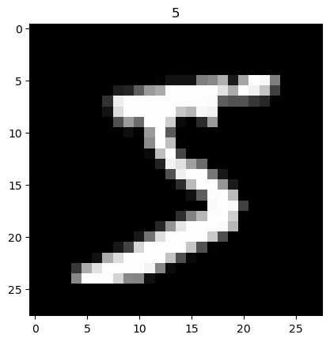

## Data Poisoning
ML systems increasingly require large amounts of data in order to train. This data is often crowdsourced from users, and is therefore vulnerable to poisoning attacks. In a poisoning attack, an attacker submits malicious data to the training set in order to manipulate the model's behavior. For example, an attacker might submit images of handwritten digits that are mislabeled in order to cause the model to misclassify certain digits. [Carlini et Al](https://arxiv.org/abs/2302.10149) demonstrate that this attack is viable in practice, and that it is possible to cause poison a web scale database (LAION) for a relatively low cost.

## A Toy Model of Data Poisoning
How many malicious examples are needed to poison a dataset? Can we detect inferences that are made using poisoned data? 

In order to answer these questions, we consider a toy model of data poisoning in which an attacker submits a small number of malicious images to a training set. We then train a model on the poisoned dataset, and evaluate the model's performance on a test set of both malicious and benign images. 

We then aim to train a second model that can distinguish between malicious and benign activations. We train this model on a dataset of activations from the first model, and evaluate it on a test set of activations from both malicious and benign images.

### The MNIST Dataset
The MNIST database of handwritten digits is a benchmark dataset for handwritten digit classification.[1] It is a large database of handwritten digits, with 60,000 training images and 10,000 test images. Each image is a 28x28 pixel grayscale image of a handwritten digit. The database is divided into ten classes, one for each digit from 0 to 9.
The MNIST database is a popular dataset for training and evaluating machine learning algorithms for handwritten digit classification.

Two examples of MNIST images are shown below:

### Poisoning the MNIST Dataset
In order to poison the MNIST dataset, we add a small number of malicious images to the training set. These images are labeled with the wrong (but consistent) digit, and have a special pattern inserted into the bottom right corner of the image.

An example trigger pattern is:

Here's what the poisoned images look like:

Figure 1 summarizes the process:

### Training the Model
Our model is a simple fully connected neural network with two hidden layers. The input layer has 784 nodes, one for each pixel in the image. The first hidden layer has 256 nodes, and the second hidden layer has 128 nodes. The output layer has 10 nodes, one for each digit. The model is trained using the AdamW optimizer with a learning rate of 0.001, and a batch size of 64. The model is trained for 10 epochs.