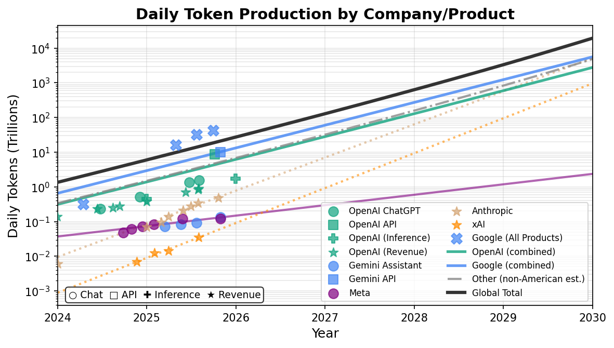
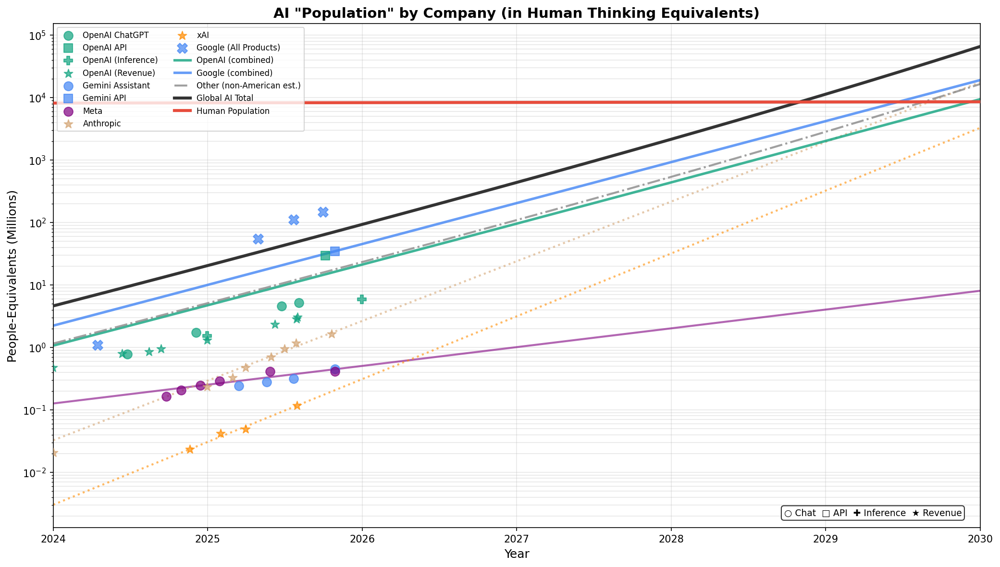
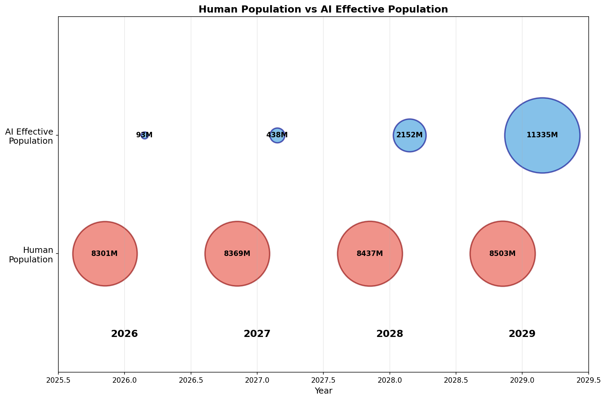

# How many "Geniuses" do we have in the datacenter right now?

## Introduction
In October 2024, Dario Amodei [wrote](https://www.darioamodei.com/essay/machines-of-loving-grace)
that AI might be like "a country of geniuses in a datacenter". He elaborated on this in [his statement](https://www.anthropic.com/news/paris-ai-summit) at the Paris AI summit, where he said:
> Time is short, and we must accelerate our actions to match accelerating AI progress. Possibly by 2026 or 2027 (and almost certainly no later than 2030), the capabilities of AI systems will be best thought of as akin to an entirely new state populated by highly intelligent people appearing on the global stage—a "country of geniuses in a datacenter"—with the profound economic, societal, and security implications that would bring.

Obviously, his statement relies on AI getting much stronger than it currently is. Right now, a given AI agent can't really be considered a "genius" in any meaningful sense. 
However, I think his characterization of AI's effects as being more similar to a country than a singular entity will probably prove to be prescient:
* The AIs likely won't be a single agent. They'll be divided both by which lab created them and who is paying for them.
* Each individual AI agent may not be particularly strong. However, because they can work around the clock at a faster pace than any human, they can get a lot done.

But this discussion got me thinking: how many "geniuses" do we have in the data center right now? That is, accounting for the fact the AIs "think" faster than humans do, and can think in parallel, how much thinking do the AIs do collectively in human terms?

The second question I want to answer is: when will the collective thinking of all AIs outweigh that of humans? Phrased differently: when will there be 8 billion "geniuses" in the data center? 

To answer these questions, we'll take a functionalist approach to thinking. That is, if a human takes $N$ seconds to think some thoughts, and the AI takes $M$ tokens to think the same thoughts, then the amount of thinking in the $N$ seconds and $M$ tokens is the same. 

We'll also assume that AI trends continue at the same rate as the past few years. This is actually not that crazy (at least for 2026 and 2027): datacenter buildout is going to bring a lot of capacity online around that time. Beyond that though, this assumption gets sketchy.

## How many token-equivalents does a person think each day?

The first part of this puzzle is figuring out how much the average person thinks, in terms of tokens.

We don't have strong numbers on how fast people's internal stream of consciousness is, but we do have numbers on people's reading and speaking WPM, which should be in the same ballpark.

According to [this study](https://www.sciencedirect.com/science/article/abs/pii/S0749596X19300786), the average silent reading speed in English is 238 wpm, and the reading aloud speed is 183 wpm. This is corroborated by [another study](https://iovs.arvojournals.org/article.aspx?articleid=2166061) stating that the reading aloud speed was 184 wpm.
Another [study on speaking speed in British English](https://francis-press.com/uploads/papers/pv7j7Z9uRgQyPUxnVTDTPecUAEP0HJcWWhGErVeD.pdf) suggests that the spoken words per minute in casual conversation is 222 wpm. 
All of this together suggests that humans think at around 230 WPM (give or take 10). 

We'll assume that the average person is awake for 16 hours a day, and that people think more or less constantly while they're awake. This isn't quite right, since babies and children sleep more, and older people sleep less, but it's probably approximately correct. Tokens are [commonly approximated](https://help.openai.com/en/articles/4936856-what-are-tokens-and-how-to-count-them) as 3/4 of a word. Putting this together, we find that each person thinks the equivalent of 294,400 tokens each day.

## How many tokens do AIs collectively process each day?

Calculating this is probably the most error prone part of the piece. It turns out AI companies are quite shy about reporting how many tokens they process. All we have to go off of are ambiguous [sama tweets](https://x.com/sama/status/1756089361609981993) (e.g., "100 billion words per day" in February 2024) and various disclosures. However, Epoch AI has done a tremendous service in [collating all of these](https://epoch.ai/data/ai-companies) in an easy to process format. 

I looked at 5 major companies: OpenAI, Anthropic, Google, Meta, and xAI. For each, I gathered whatever data was available (revenue, inference spending, user counts, direct token disclosures) and tried multiple estimation methods. Where possible, I separated chat and enterprise/API usage, since they have different growth dynamics. I also adjusted upward to account for Chinese companies and smaller players, using [global compute ratios from Epoch](https://epoch.ai/blog/trends-in-ai-supercomputers). The US controls about 75% of worldwide compute as of March 2025.

Consider these numbers in the spirit of a [Fermi estimate](https://en.wikipedia.org/wiki/Fermi_problem). They're meant to capture the general scale rather than be exact. For the full methodology and per-company breakdowns, see [the detailed version of this post](thinking_post.md).

Here's what the projections look like when you put them together:

## How many "geniuses" are in the data center right now?

Based on the token model, there are about 27.4T tokens being processed per day in Jan 2026. This equates to about 93 million people's worth of thinking, based on our estimate of 294,400 tokens per day per person.

With 93 million people, AI collectively already forms a healthy sized country! For reference, a population of 93 million would place the country about halfway between Iran (85.9 million) and Vietnam (101.3 million).

The "country of geniuses in a datacenter" is already almost real.
The amount of labor being done by AIs right now would already take an entire human country's worth of people to do. The only difference is that our data center is filled with midwits and not geniuses (at least for now).  
In some sense, this is unsurprising. With how much AI is being mentioned and discussed today, it would be surprising if the amount of actual labor being done was much lower than amount we see. 

## When will the crossover happen?

If we use the same conversion ratio on the token graph, we can visualize the growth of tokens processed as "population in the datacenter":

I've included human population as a red line, showing that the intersection will occur around late 2028. Note that this includes population growth! It's just incredibly difficult to see on this logarithmic scale.

We can make it easier to visualize with this bubble chart:

| Year (Jan 01) | Human Population | AI "Population" | AI as % of Human |
| --| -- | -- | -- |
| 2026| 	8.30B| 	93M |	1.1%
| 2027| 	8.37B| 	438M |	5.2%
| 2028| 	8.44B| 	2.15B |	25.5%
| 2029| 	8.50B| 	11.3B |	133.3%

Let's take the conceptualization of AI as a country seriously for a minute. What would the implications be?

First, it's obvious that this country is growing at an incredible rate. The projections for the next 4 years show a roughly 400% annual growth. The country with the current highest growth rate is Niger, but it has an annual growth rate of only 3.8%. This country would have a growth rate more than 100 times that!

Second, it's obvious that this country is going to produce a lot. In terms of services, a lot of labor is going to be offshored here. These people work around the clock, they accept tiny wages, and their population is always growing. Junior software developers have a lot to fear. But, there's also the cultural products: all countries produce things like literature, music, and memes, and this one will be no exception. Catchphrases like "You're absolutely right!" have already entered into the global consciousness. This will likely intensify over the next few years. 

Third, it's clear that this country, if it existed, would be shaping up to be a serious national security threat to the US. Their explosive population growth means that they have an incentive to compete with us for naturally limited resources like water, energy, and land. Their citizens are naturally skilled at launching cyberattacks, and they grow smarter each year. However, it's also true that their citizens are generally peaceful, and are not loyal to the idea of an "AI country", at least for now.

Of course, this metaphor isn't perfect: The AI country lacks physical presence, leadership, and is utterly dependent on the goodwill of private companies to continue existing. But the analogies are strong enough that it makes a potent intuition pump.

## Conclusion

AI usage, as measured by tokens, has been growing exponentially over the past 2-3 years. Multiple lines of evidence, including revenue, compute spending, and stated usage, all point towards continued growth. Companies have already put down the money to build the data centers to support this rate of growth for the next year or two. That being said, these are Fermi-level estimates, meant to capture the general scale rather than be exact. And after the next few years, I'm less confident: exponential growth can't last forever.

Regardless, the implications of even the next two years will be immense. AI already collectively processes around 27.4 trillion tokens per day as of January 2026. This equals 93 million people's worth of thinking, roughly the population of a country between Iran and Vietnam. This country will grow at roughly 400% annually, unprecedented by human standards. By Jan 2029, in 3 years, the AI "population" will be 11.3 billion, 133% of human population. 

Dario points out that "country of geniuses in a datacenter" would bring "profound economic, societal, and security implications". He's most likely correct. Navigating the next few years will be tricky along many dimensions. However, I'm confident that if we manage it, we will be able to reap immense benefits for all.
