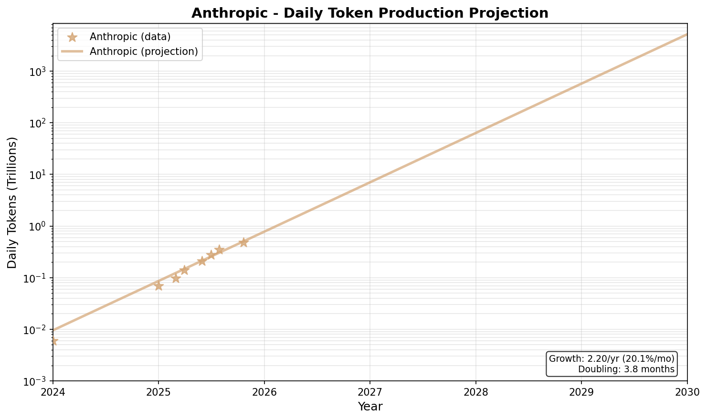
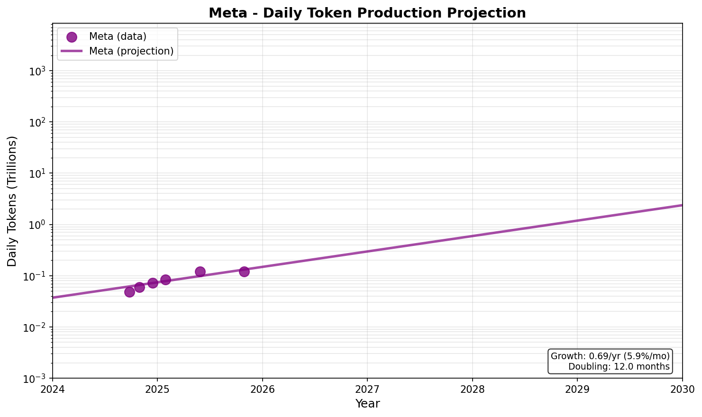
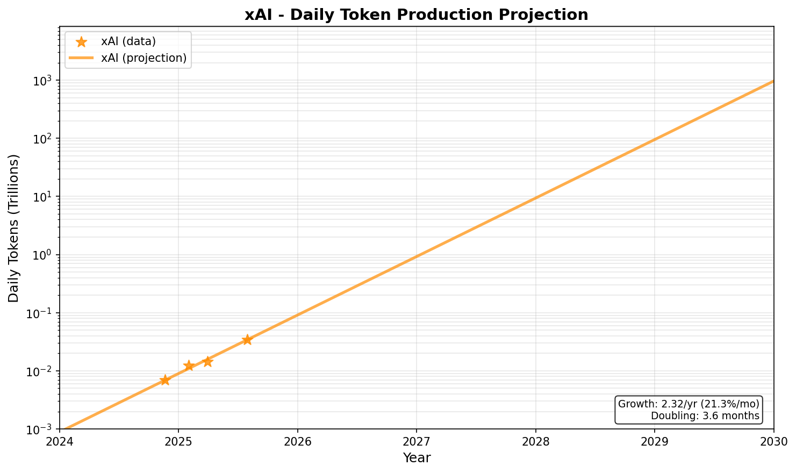

# How many "Geniuses" do we have in the datacenter right now?

## Introduction
In October 2024, Dario Amodei [wrote](https://www.darioamodei.com/essay/machines-of-loving-grace)
that AI might be like "a country of geniuses in a datacenter". He elaborated on this in [his statement](https://www.anthropic.com/news/paris-ai-summit) at the Paris AI summit, where he said:
> Time is short, and we must accelerate our actions to match accelerating AI progress. Possibly by 2026 or 2027 (and almost certainly no later than 2030), the capabilities of AI systems will be best thought of as akin to an entirely new state populated by highly intelligent people appearing on the global stage—a “country of geniuses in a datacenter”—with the profound economic, societal, and security implications that would bring.

Obviously, his statement relies on AI getting much stronger than it currently is. Right now, a given AI agent can't really be considered a "genius" in any meaninful sense. 
However, I think his characterization of AI's effects as being more similar to a country than a singular entity will probably prove to be a wise choice:
* The AIs likely won't be a single agent. They'll be divided both by which lab created them and who is paying for them.
* Each individual AI agent may not be particularly strong. However, because they can work around the clock at a faster pace than any human, they can get a lot done.

But this discussion got me thinking: how many "geniuses" do we have in the data center right now? That is, accounting for the fact the AIs "think" faster than humans do, how much thinking do the AIs do collectively in human terms? 

The second question I want to answer is: when will the collective thinking of all AIs will outweigh that of humans?  Phrased differently: when will there be 8 billion "geniuses" in the data center? 

AI usage is growing exponentially at the present moment. While exponential growth isn't guaranteed to continue, if it does, the crossover point might only be a few years away. To be clear, the crossover point doesn't intrinsically mean anything special. By then, the labor market, and the world at large, will already have been radically altered. However, I think it's worth keeping this date in mind as a marker for when human thought will be in the minority, and not the majority. 

Obviously, both of these are difficult questions to answer, so we'll need to make a few key simplifications. The biggest one is that we'll take a functionalist approach to thinking. That is, if a human takes $N$ seconds to think some thoughts, and the AI takes $M$ tokens to think the same thoughts, then the amount of thinking in the $N$ seconds and $M$ tokens is the same. We'll totally ignore factors like whether the human could have reached the answer faster without as much thinking.

Secondly, we'll assume that AI trends continue at the same rate as the past few years. This is actually not that crazy (at least for 2026 and 2027): datacenter buildout is going to bring a lot of capacity online around that time. Beyond that though, this assumption gets sketchy.

With these two assumptions in mind, let's go!

### Table Of Contents
1. How many tokens do AIs collectively process each day?
    1. OpenAI
    2. Anthropic 
    3. Google
    4. Meta
    5. xAI
    6. Bringing it together
    7. Limitations
2. How many token-equivalents does the average person think each day?
3. How many geniuses are in the data center right now?
4. When will the crossover happen?

## How many tokens do AIs collectively process each day?

Calculating this is probably the most error prone part of the piece. It turns out AI companies are quite shy about reporting how many tokens they process. All we have to go off of are ambiguous [sama tweets](https://x.com/sama/status/1756089361609981993) (e.g., "100 billion words per day" in February 2024) and various disclosures. However, Epoch AI has done a tremendous service in [collating all of these](https://epoch.ai/data/ai-companies) in an easy to process format. 

Our goal is not only to find the number of tokens collectively processed each day today (Dec 2025), but to project this out into the future assuming exponential growth at current rates, so that we can find a crossover point. The assumption of exponential growth is very iffy in the long run, but it's the simplest model that we have that fits the data in the short run (the past 2-3 years).  

Every company has different types of data available for it, and different business models. For Anthropic in particular, we have barely *any* data beyond revenue and inference compute. We'll necessarily have to do a bit of guesswork. Consider these numbers in the spirit of a [Fermi estimate](https://en.wikipedia.org/wiki/Fermi_problem). Nonetheless, even Fermi-level estimates are helpful for determining the general scale of what the effective AI population is.

Our methodology to approach this problem is going to be to split the market up into 5 major companies, independently try to estimate a projection of tokens used and then sum these up. In some cases, we'll split the company estimates by product in order to disambiguate between different metrics.

Where possible, we also want to separate out chat and enterprise usage.
This is important, since I expect chat token usage to grow slower than enterprise usage over long time horizons. Enterprise usage can grow much larger much faster, as companies adopt AI and replace human workers, while chat usage will naturally cap out as AI chatbots reach everyone with internet. [Recent research from Epoch](https://epochai.substack.com/p/the-changing-drivers-of-llm-adoption) indicates that ChatGPT user growth is indeed slowing.

Our companies are:
1. OpenAI
2. Anthropic 
3. Google
4. Meta
5. xAI

Unfortunately, we lack detailed data on smaller competitors and Chinese companies, and thus will have to exclude them from our analysis. We'll attempt to account for this after our initial estimate, though.

### OpenAI

OpenAI is the company for which we have the best quality data. We have direct message counts for ChatGPT between Jun 2024 and Aug 2025, per-year revenue data, per-year inference compute spend, a point-in-time estimate of total tokens processed per day (Sam's tweet), as well as a point-in-time estimate of API token rates.

The approach we'll take to get our final answer is to try multiple different estimation methods, and then average them together to get a final per-company guess.

#### Approaches

**Inference-scaled**: Inference compute spending should be proportional to the number of tokens produced, as producing tokens costs money. We have enough points to draw a curve of inference spending. What we lack is the conversion factor between inference spending and tokens produced. To find this, we interpolate what the inference spending would have been in Feb 2024 when Sam made the tweet (which turns out to be $0.54B). From this, we can calculate you get 248 tokens/day per marginal $ you spend on inference compute.

Let's sanity check this: if we take 1 dollar for 248 tokens a day for a whole year this is equal to $11/MToken. This is definitely in the right ballpark! (For reference, GPT 5.2 is 1.75$/MToken for input, and $14.00/MToken for output, but 5.2 Pro is more expensive).

**Revenue-scaled**: Revenue should also be proportional to the number of tokens produced. Operationalizing this is pretty similar to the inference-scaled approach, but using the revenue growth trend instead of the inference spending growth trend. The difference is we have 8 data points for revenue instead of just 2 for inference compute, so I'd expect this value to be slightly more reliable.

The daily tokens per dollar of revenue ends up being 69.20 tokens/day per $ (equal to $40/MToken). This is slightly more expensive than I'd expect, but not implausible given that they probably have higher margins from ChatGPT than through the API. 

**Product-Based**: For our final OpenAI analysis, we'll directly look at OpenAI's 2 main products (ChatGPT and the API) and attempt to calculate how many tokens they use individually, and then combine them.
* **ChatGPT**: We have pretty good data on daily messages for ChatGPT. We'll assume (somewhat arbitrarily) that there are 512 tokens per message. This is a couple of paragraphs in practice.
* **API**: In their [2025 DevDay video](https://www.youtube.com/watch?v=hS1YqcewH0c), OpenAI notes they process 6B tokens/min on the API, working out to 8.64T tokens/day. We only have that single point-in-time estimate though. We'll use the overall industry growth trend (calculated later) to calculate how fast the API grows. (This is a sketchy assumption, but it's the best we can do with just 1 data point).

Here's what they look like plotted together on a graph: 

### Anthropic

For Anthropic, the main challenge is that our data is much sparser. We have one estimate of inference spend ($2B in Jul 2025), and 8 points of revenue data. Thus, we can only use the revenue based approach. 

#### Approaches
**Revenue-based**: We can draw a curve through the revenue for Anthropic, and then scale it using the same 69.20 tokens/day per $ of revenue that we get for OpenAI. 

We can use our one estimate of inference spend to roughly sanity check this: the tokens per $ on inference should be reasonable. Using the revenue based approach above, we get 0.3T tokens/day around when the annualized inference spend was measured. Thus, we get 154 Anthropic tokens per day per marginal dollar spent on inference, about 62% of what OpenAI has. This is equivalent to $17.79/MToken. Definitely seems to be in the right ballpark, considering that Claude Opus is quite popular, and very expensive. 

Here's a plot of Anthropic's token projections:

### Google

We actually have a lot of data for Google:
1. Total tokens across all Google AI products
2. Gemini Monthly Active User (MAU) data
3. Gemini daily chat messages (one point-in-time estimate), [from a Google antitrust court testimonial](https://www.theinformation.com/briefings/googles-gemini-user-numbers-revealed-court). 
4. Gemini API tokens/min (one point-in-time estimate)

If we could just use the total tokens across all Google AI products, that would be great! These numbers are reported directly by Google, and have exactly the metric we want, tokens. There's one issue: their numbers absolutely dwarf everyone else's. They [report 43T tokens/day on Sep 30, 2025](https://x.com/demishassabis/status/1976712484657475691). This is 10.2x our best guess (computed above) for OpenAI at the same date. 

This sort of makes sense: Google injects Search Overview into basically every google search, and also provides Google Translate services. I think these bias the underlying trend, since they are fundamentally different businesses, and won't grow at the same rate as API usage or chat usage will.

So, we'll ignore those data points, and use a similar approach to OpenAI's per-product estimation. 

#### Approaches
**Product-Based**: We'll directly look at Gemini Assistant usage and the Gemini API, attempt to calculate how many tokens they use individually, and then combine them.
* **Gemini Assistant**: We have many MAU data points, allowing us to draw a growth curve for the number of MAUs. Since we have the daily messages for March 28, 2025, we can interpolate the number of MAUs at that point, and calculate how many messages a monthly active user sends per day. If we do the math, we end up with about 0.4 messages/day. We'll use the same 512 tokens/message figure as ChatGPT. 
* **Gemini API**: Similar to OpenAI, we have a single direct token measurement (10.08T/day, from [their earnings report](https://s206.q4cdn.com/479360582/files/doc_financials/2025/q3/2025q3-alphabet-earnings-release.pdf)). Like what we did in OpenAI, we'll impute the growth rate as the industry average growth rate, with the associated caveats that this is not necessarily sound.

We add these estimates together to produce a final guess for the *relevant* component of Google's tokens:

Note: we include the "All AI products" reports in this graph for reference (red X markers), although they're not used in the final estimate.

One thing to notice is that the API Gemini usage basically dominates the assistant message token count. 

### Meta

Meta is basically a pure assistant platform. They don't have a popular enterprise AI offering. We have pretty good data on their monthly active users (6 data points), and one point in time estimate of daily messages from the [same court testimonial](https://www.theinformation.com/briefings/googles-gemini-user-numbers-revealed-court). 

#### Approaches
**MAU-based**: We can use a similar approach as the one we did for Gemini Assistant. We interpolate the number of MAUs at March 28, and then find how many messages a monthly active user sends per day. For Meta, this turns out to be 0.235, less than Google. We can then multiply by 512 tokens/message as before. 

Here's the graph:

Unfortunately for Meta, they do not make up a large proportion of future tokens. 

### xAI

We have relatively little data about xAI. We have 4 revenue data points starting from Nov 2024. We also have their daily message count from the Google trial. 

We'll use the revenue-based method since it's the only one we're able to draw a curve with:

#### Approaches

**Revenue-based**: Like we did before for Anthropic, we can draw a curve through the revenue for xAI, and then scale it using the same 69.20 tokens/day per $ of revenue that we get for OpenAI.

Unlike Anthropic, we don't have inference compute to sanity check against. Unfortunately, xAI has both API and Chat revenue, so we can't really use their chat message count to validate that the token count lines up, since it would give us an artificially inflated token count per message (since we'd count API tokens in the chat bucket).  

In any case, here's the graph:

### Industry growth rate

Earlier, I mentioned that we'd set the OpenAI and Gemini API growth rates to the industry growth rate. The reason it's the industry growth rate and not the per-company growth rate is because I don't have enough Gemini data to feel confident basing on that. I am more confident on the overall OpenAI growth rate though, but elected to use a similar approach both for OpenAI and Gemini.

We calculate it by averaging the following components:
* avg(OpenAI Inference, OpenAI Revenue): avg(1.36, 1.26) = 1.31/year
* Anthropic: 2.20/year
* xAI: 2.32/year
* Meta: 0.69/year
  * I'm somewhat on the fence about including Meta, as it may be artificially weighing down the true growth rate.
* Gemini Chat: 1.05/year
Industry growth rate: 1.51/year

### Bringing it all together

Note that just summing the above 5 companies won't be sufficient to get global token counts. We're not accounting for Chinese companies and other competitors. Unfortunately, I wasn't able to find detailed data for MAUs or API usage for Chinese companies. We also don't have detailed data on smaller American and European companies (although I suspect these wouldn't change the balance significantly). 

To resolve this, we'll take the ratio of rest of the world's compute to the US's compute, and multiply the overall result by that. Epoch also helpfully [provides this ratio](https://epoch.ai/blog/trends-in-ai-supercomputers). It turns out the US controls about 75% of worldwide compute as of March 2025, and China around 15%. 

Now that we have all 5 AI companies, plus the estimate of other players, let's see what it looks like when we put them on the same graph (alongside the human token projection as well):

### Limitations

There are some obvious issues with the approach used here. I'll name the largest ones:
1. It's not justified to use an exponential this far into the future. AI will not grow exponentially forever. There could also be developments that enable stronger reasoning with fewer tokens.
    1. Also, the per-company projections are even less reliable. Companies fail and get replaced all the time. This model doesn't account for that.
2. The growth of the Gemini and OpenAI APIs is given mostly by the overall industry growth rate. This makes our overall prediction extremely sensitive to that parameter, especially in the long time horizon limit. The methodology for calculating this is pretty ad hoc. This is actually the bit of the prediction I am the least confident in.
3. All of our revenue based predictions are effectively based off of a single sama tweet. 
4. We're not considering internal/non-public AI usage.

But all that being said, I think it's ballpark correct, especially for the next ~year. I have much less confidence for any time horizon beyond that. The crossover point should not be taken seriously. 

## How many token-equivalents does a person think each day?

The second part of this puzzle is figuring out the how much the average person think, in terms of tokens.

We don't have strong numbers on how fast people's internal stream of consciousness is, but we do have numbers on people's reading and speaking WPM, which should be in the same ballpark.

According to [this study](https://www.sciencedirect.com/science/article/abs/pii/S0749596X19300786), the average silent reading speed in English is 238 wpm, and the reading aloud speed is 183 wpm. This is corroborated by [another study](https://iovs.arvojournals.org/article.aspx?articleid=2166061) stating that the reading aloud speed was 184 wpm.
Another [study on speaking speed in British English](https://francis-press.com/uploads/papers/pv7j7Z9uRgQyPUxnVTDTPecUAEP0HJcWWhGErVeD.pdf) suggests that the spoken words per minute in casual conversation is 222 wpm. 
All of this together suggests that humans think at around 230 WPM (give or take 10). 

We'll assume that the average person is awake for 16 hours a day, and that people think more or less constantly while they're awake. This isn't quite right, since babies and children sleep more, and older people sleep less, but it's probably approximately correct. Tokens are [commonly approximated](https://help.openai.com/en/articles/4936856-what-are-tokens-and-how-to-count-them) as 3/4 of a word.Putting this together, we find that each person thinks the equivalent of 294,400 tokens each day.

## How many geniuses are in the data center right now?

Based on the model we put together, we expect 20 552 614 050 646

## When will the crossover happen?

Here's how this looks over time, accounting for population growth:

Based on the above graph, around late 2028!

Here's how human and AI thinking compare in the coming years:

| Year (Jan 01) | Human Token-equivalents | AI Tokens | AI as % of Human |
| --| -- | -- | -- |
| 2026| 	2444T| 	27T |	1.1%
| 2027| 	2464T| 	129T |	5.2%
| 2028| 	2484T| 	634T |	25.5%
| 2029| 	2503T| 	3337T |	133.3%

## Implications

The most surprising takeaway for me is just how small of a percentage AI thinking is compared to human thinking. Right now, despite all the fanfare, AI thinking makes up only 1.1% of human thought. 

However, due to the nature of exponential growth, it will probably soon catch up. I'm quite confident in the overall thesis that AI enterprise usage will grow approximately exponentially over the next 2-3 years. We're only seeing the beginning of the wave of automation that will occur. 

But even though the amount of AI thinking is likely to eclipse human thinking at some point in the future, assuming current growth trends, this doesn't necessarily imply that AI welfare will eclipse human welfare. 

AIs, despite their remarkable abilities, may be similar to either P-zombies (creatures that behave as if they are conscious, but lack any internal experience), or David Chalmers's [Vulcans](https://philpapers.org/rec/CHASAM-11) (creatures that consciously perceive, think, and act, but don't experience pain or pleasure).

I tend to lean towards assigning a nonzero moral weight towards AIs, especially as they inch towards neuron counts rivalling the synapse counts of humans. For reference, adult humans [have](https://www.neurology.org/doi/10.1212/01.WNL.0000166914.38327.BB) anywhere between 100 and 500 trillion synapses, and three year olds have 1 quadrillion. The largest AI models are [estimated](https://epoch.ai/data/ai-models) to have ~3 trillion parameters. This doesn't guarantee anything, but it does indicate that the "raw compute" might be there.

Future models may have more, but I expect the growth rate of model parameters to be slower than in the past, as companies are tending to invest more into RL and algorithmic improvements over pure model size scaleups. GPT-4.5, for example, was likely a very large model, but due to its expense and poor performance on agentic tasks, it never made it beyond a research preview.

Altogether, I think there are three key takeaways:

1. **AI welfare is a small issue today.** Even under the maximalist interpretation, AI thinking accounts for only ~1% of human thinking. Thus, unlike issues like factory farming, AI welfare isn't yet a moral catastrophe. We have some time to manuever.

2. **This will change fast.** Assuming current growth trends hold, the amount of thinking done by AI will surpass that done by humans by late 2028. 

3. **We should err on the side of caution.** We don't know if AIs are conscious, and we may never know for certain. However, the sheer scale of the issue implies that it's worth treading carefully here.

The good news is that treating AIs well doesn't require certainty about their moral status. Many of the interventions that would improve AI welfare (things like avoiding unnecessary "suffering" states and being thoughtful about training objectives) are also good for making AI systems more reliable and aligned with human values.