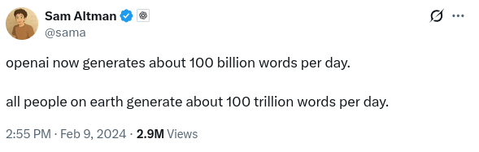
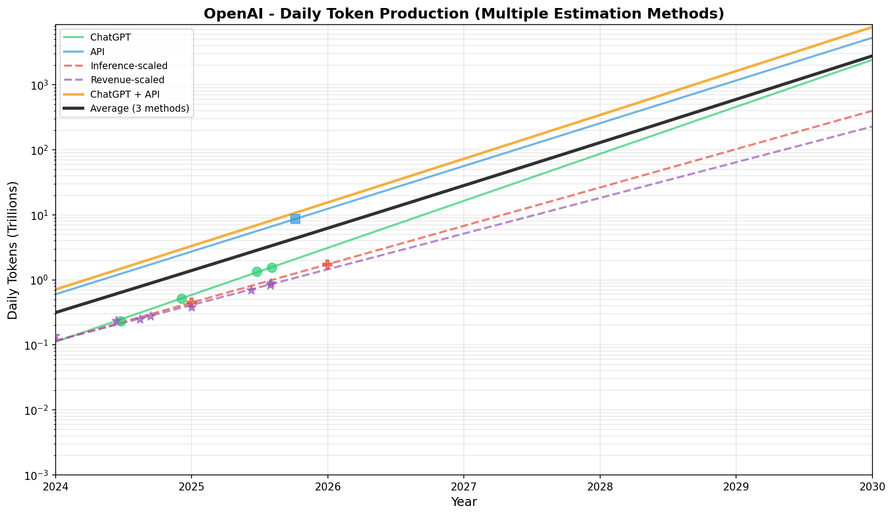

# Twitter Thread: Country of Geniuses

## Tweet 1 (Hook + provocative result)
Dario Amodei (Anthropic CEO) says AI will be like "a country of geniuses in a datacenter" by 2026-2030.

But how many "geniuses" are already in the datacenter?

And will there ever be a time when the number of "geniuses" exceeds the total human population?

I did the math. 🧵

---

## Tweet 2 (Operationalization)

To operationalize this, I'll take a functionalist approach to thinking.
We'll say that if a human takes N seconds to think some thoughts, and the AI takes M tokens to think the same thoughts, then the amount of "thinking" in the N seconds and M tokens is the same.

---

## Tweet 2 (The problem)
So, we need to find how many tokens the AI industry processes. AI companies are shy about sharing this, but sometimes they drop hints.

For example, in Feb 2024, Sam Altman tweeted OpenAI generates "100 billion words per day."

--- 

## Tweet 3 (The logic)
We know OpenAI's approximate revenue in Feb 2024. If revenue is proportional to tokens processed, we can use revenue growth to estimate tokens today.

I also tried a few alternative approaches, like assuming tokens were proportional to inference spend, or looking at ChatGPT MAUs.

---

## Tweet 4 (AI total)
I applied a similar approach for Anthropic, Google, Meta, and xAI. (And then adjusted up to account for Chinese companies + smaller players) 

Result: AIs collectively process ~27.4 trillion tokens/day as of Jan 2026.

---

## Tweet 5 (The reveal)
27.4T tokens/day = 93 million people's worth of thinking.

AI already forms a country between Iran and Vietnam in size. However, I'd characterize it as a country of midwits, not geniuses, explaining why we're not yet reaping the benefits (innovation and automation wise).

---

## Tweet 6 (Crossover)
When will AI "population" exceed that of humans?

At ~400% annual growth: late 2028.

By Jan 2029, AI will do 11.3 billion people's worth of thinking. 133% of humanity.

---

## Tweet 7 (Table)
The trajectory:

2026: 93M (1.1% of humans)
2027: 438M (5.2%)
2028: 2.15B (25.5%)
2029: 11.3B (133%)

Its growth rate would be 100x faster than Niger, the world's fastest-growing country.

---

## Tweet 8 (Link + close)
Full analysis with methodology:
[LINK TO POST]

---

## Character counts
1. 262 chars ✓
2. 175 chars ✓
3. 236 chars ✓
4. 211 chars ✓
5. 163 chars ✓
6. 185 chars ✓
7. 203 chars ✓
8. 159 chars + link ✓
