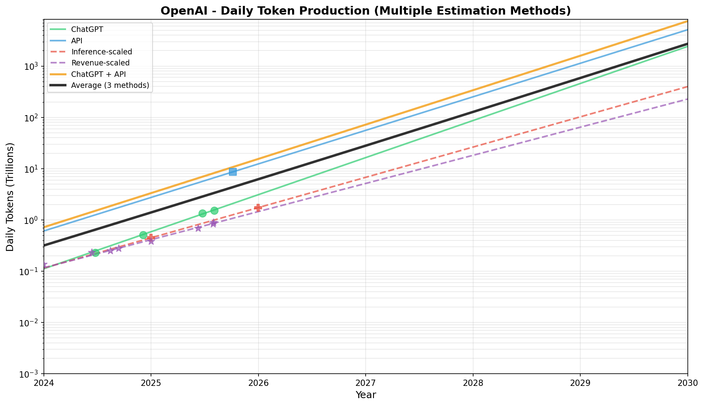

# When will AI Welfare overtake Human Welfare?

## Introduction
In April 2025, Anthropic [announced](https://www.anthropic.com/research/exploring-model-welfare) that they were building a research program investigating the possibility of AI model welfare.
The hypothesis is that if AI models become sufficiently advanced, they may start to experience qualia,
and as such, their experiences may have moral weight.

Obviously, this idea is controversial, and difficult (some would say impossible) to verify.
But, leading philosophers of mind like David Chalmers [have suggested](https://arxiv.org/abs/2411.00986) that model welfare is plausible. 

All that being said, it sure *seems* like AI is conscious. 
Whenever I chat with an AI, it *seems* like there's a well-educated, if occasionally obtuse, human on the other end of the chat interface.
If this were true, then we would surely have a duty to ensure that that person was kept generally happy. 

Let's call this the **maximalist** interpretation of AI consciousness:
1. AI is exactly as conscious as a human.
2. The amount of conscious experience the AI experiences is equal to the amount of time it would take a human to think those tokens. (Setting aside the question of whether the human is smart enough to think those exact tokens).

The issue is, even with the maximalist interpretation, it's tough to figure out how big of an issue AI welfare is. How many tokens are generated each day? How many token-equivalents does humanity experience each day? When will AIs collectively experience more than humans collectively experience?

To be clear, I don't believe in the maximalist interpretation. However, I do think the maximalist interpretation offers a kind of "upper bound" we can use to think about when AI welfare could even start to matter. Thus, I think finding an answer to the above questions is worth doing.

### Table Of Contents
1. How many token-equivalents does humanity experience each day?
2. How many tokens do AIs collectively process each day?
    1. OpenAI
    2. Anthropic 
    3. Google
    4. Meta
    5. xAI
3. When will the crossover happen?
4. Summary

## How many token-equivalents does humanity collectively experience each day?

The maximalist view takes a functionalist approach to consciousness. That is, if a human takes $N$ seconds to think some thoughts, and the AI takes $M$ tokens to think the same thoughts, then the amount of experience in the $N$ seconds and $M$ tokens is the same.

We don't have strong numbers on how fast people's internal stream of consciousness is, but we do have numbers on people's reading and speaking WPM, which should be in the same ballpark.

According to [this study](https://www.sciencedirect.com/science/article/abs/pii/S0749596X19300786), the average silent reading speed in English is 238 wpm, and the reading aloud speed is 183 wpm. This is corroborated by [another study](https://iovs.arvojournals.org/article.aspx?articleid=2166061) stating that the reading aloud speed was 184 wpm.
Another [study on speaking speed in British English](https://francis-press.com/uploads/papers/pv7j7Z9uRgQyPUxnVTDTPecUAEP0HJcWWhGErVeD.pdf) suggests that the spoken words per minute in casual conversation is 222 wpm. 
All of this together suggests that humans think at around 230 WPM (give or take 10).

Now, a simple first-order approximation of the number of waking human minutes is to assume each of the roughly 8 billion humans is awake for 16 hours a day. This yields 7680 billion waking minutes each day. This isn't quite right, since babies and children sleep more, and older people sleep less, but it's probably approximately correct.

Tokens are [commonly approximated](https://help.openai.com/en/articles/4936856-what-are-tokens-and-how-to-count-them) as $\frac{3}{4}$ of a word.

Putting it all together, we get:
$$
\frac{230 \text{  words}}{\text{minute}} \cdot (7680 \cdot 10^9 \text{  minute}) \cdot \frac{4 \text{  tokens}}{3 \text{  words}} = 2355.2 \cdot 10^{12} \text{  tokens}
$$

Here's how this looks over time, accounting for population growth:

## How many tokens do AIs collectively process each day?

Calculating this is probably the most error prone part of the piece. It turns out AI companies are quite shy about reporting how many tokens they process. All we have to go off of are ambiguous [sama tweets](https://x.com/sama/status/1756089361609981993) (e.g., "100 billion words per day" in February 2024) and various disclosures. However, Epoch AI has done a tremendous service in [collating all of these](https://epoch.ai/data/ai-companies) in an easy to process format. 

Our goal is not only to find the number of tokens collectively processed each day today (Dec 2025), but to project this out into the future assuming exponential growth at current rates, so that we can find a crossover point. The assumption of exponential growth is very iffy in the long run, but it's the simplest model that we have that fits the data in the short run (the past 2-3 years).  

Every company has different types of data available for it, and different business models. For Anthropic in particular, we have barely *any* data beyond revenue and inference compute. We'll necessarily have to do a bit of guesswork. Consider these numbers in the spirit of a [Fermi estimate](https://en.wikipedia.org/wiki/Fermi_problem). Nonetheless, even having Fermi-estimate tier numbers will tell us a lot about the scale of the AI welfare problem. 

Our methodology to approach this problem is going to be to split the market up into 5 major companies, independently try to estimate a projection of tokens used and then sum these up. In some cases, we'll split the company estimates by product in order to disambiguate between different metrics.

Our companies are:
1. OpenAI
2. Anthropic 
3. Google
4. Meta
5. xAI
Unfortunately, we lack data on smaller competitors and Chinese companies, and thus will have to exclude them from our analysis. We'll attempt to account for this after our initial estimate, though.

### OpenAI

OpenAI is the company for which we have the best quality data. We have direct message counts for ChatGPT between Jun 2024 and Aug 2025, per-year revenue data, per-year inference compute spend, a point-in-time estimate of total tokens processed per day (Sam's tweet), as well as a point-in-time estimate of API token rates.

The approach we'll take to get our final answer is to try multiple different estimation methods, and then average them together to get a final per-company guess.

#### Approaches

**Inference-scaled**: We fit an exponential to the inference compute spending growth trend and then find the interpolated inference in Feb 2024 when Sam made the tweet (which turns out to be \$0.54B). From this, we can calulate you get 248 tokens/day per \$ you spend on inference compute each year.

If we take 1 dollar for 248 tokens a day for a whole year this is equal to \$11/MToken, which seems to be roughly in the right ballpark. (For reference, GPT 5.2 is 1.75\$/MToken for input, and \$14.00/Mtoken for output, but 5.2 Pro is more expensive).

**Revenue-scaled**: This works pretty similarly to the inference-scaled approach, but using the revenue growth trend instead of the inference spending growth trend. The difference is we have 8 data points for revenue instead of just 2 for inference compute, so I'd expect this value to be slightly more reliable. 

The daily tokens per dollar of revenue ends up being equal to \$40/MToken. This is slightly more expensive than I'd expect, but not implausible given that they probably have higher margins from ChatGPT than through the API. 

**Product-Based**: For our final OpenAI analysis, we'll directly look at OpenAI's 2 main products (ChatGPT and the API) and attempt to calculate how many tokens they use individually, and then combine them.
* **ChatGPT**: We have pretty good data on daily messages for ChatGPT. We'll assume (somewhat arbitrarily) that there are 512 tokens per message. This is a couple of paragraphs in practice.
* **API**: In their [2025 DevDay video](https://www.youtube.com/watch?v=hS1YqcewH0c), OpenAI notes they process 6B tokens/min on the API, working out to 8.64T tokens/day. We only have that single point-in-time estimate though. We'll use the overall industry growth trend (calculated later) to calculate how fast the API grows. (This is a sketchy assumption, but it's the best we can do with just 1 data point).

Here's what they look like plotted together on a graph: 

### Anthropic

For Anthropic, the main challenge is that our data is much sparser

- **Data available**: Rich revenue data (8 points: $87M Jan 2024 → $7B Oct 2025), one inference spend data point (~$2B annualized, Jul 2025)
- **Challenge**: No direct token or message data; must infer from financial metrics
- **Approach**: Use tokens-per-revenue ratio derived from OpenAI's anchor point (Sam's tweet + OpenAI revenue at that date), apply to Anthropic's revenue curve
- **Rationale**: Revenue should scale roughly with token production (more usage → more revenue); this leverages Anthropic's actual growth curve rather than assuming arbitrary rates

### Google

- **Data available**: "All AI products" figures (9.7T → 1.3Q monthly tokens), Gemini API rate (7B/min, Oct 2025), Gemini chat messages (140M/day, Mar 2025), Gemini MAU data
- **Challenge**: "All AI products" includes Search AI Overviews, Translate, etc. which don't scale comparably to LLM inference
- **Approach**: Use Gemini-only data, split into two series:
  - **Gemini Assistant**: MAU × messages-per-MAU ratio (0.4, from Mar 2025 data) × 512 tokens/message
  - **Gemini API**: Direct token measurement (10.08T/day from 7B/min)
- **Rationale**: Excluding "all AI products" makes Google comparable to other enterprise AI providers; the inflated figures would skew the total unrealistically
- **Note**: "All AI products" data points are shown on charts for reference but excluded from projections

### Meta

- **Data available**: Rich MAU data (400M Sep 2024 → 1B May 2025, then plateaued), daily messages (200M, Mar 2025 from Google antitrust trial)
- **Challenge**: MAU data is abundant but messages data is sparse (single point)
- **Approach**: 
  - Interpolate MAU at Mar 2025 (~850M) from surrounding data points
  - Compute messages/MAU ratio: 200M messages / 850M MAU = 0.235 messages/MAU/day
  - Apply ratio to all MAU data points, convert to tokens (× 512 tokens/message)
- **Rationale**: MAU growth drives message growth; the messages/MAU ratio captures engagement intensity and allows extrapolation from the richer MAU dataset

### xAI

- **Data available**: Revenue data (4 points: $100M Nov 2024 → $500M Jul 2025), daily messages (75M, Mar 2025 from Google trial)
- **Challenge**: No direct token or inference spend data; newest and smallest of the major players
- **Approach**: Use tokens-per-revenue ratio (same as Anthropic method), apply to xAI's revenue data
- **Rationale**: Revenue-based estimation is the most reliable method given available data; actual revenue growth (4 points) is better than arbitrary assumptions

## Summary

But even if some degree of AI model consciousness is possible, it raises the question of how we should compare AI welfare to human welfare. Most people agree that human consciousness is richer and deeper than the consciousness of a pig or chicken. Similarly, the first AIs to possess a degree of consciousness will likely be "less conscious" than a human would be.
